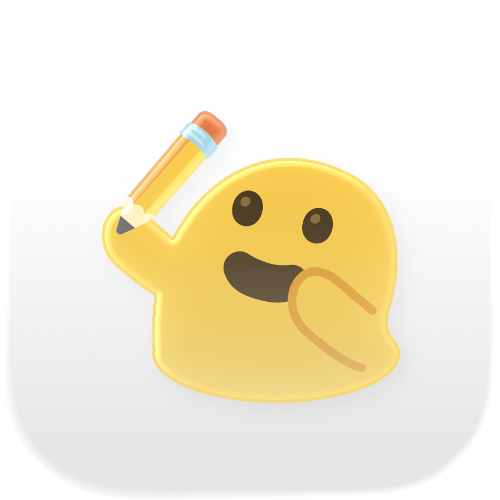

<div align="center">
  
  <h1>OpenJam</h1>
  <p><strong>A collaborative whiteboard for teams</strong></p>

  <p>
    <a href="#features">Features</a> •
    <a href="#quick-start">Quick Start</a> •
    <a href="#development">Development</a> •
    <a href="#deployment">Deployment</a> •
    <a href="#contributing">Contributing</a>
  </p>

  <!-- Add badges here when available -->
  <!--  -->
  <!--  -->
</div>

---

## Features

- 🎨 **Real-time Collaboration** - Work together on the same canvas with your team
- 🖼️ **Rich Drawing Tools** - Shapes, freehand drawing, text, and more
- 💾 **Auto-save** - Never lose your work
- 🔒 **Secure** - Session-based authentication
- 📤 **Export** - Save your boards as images
- 🐳 **Docker Ready** - One-command deployment

## Quick Start

The fastest way to run OpenJam:

```bash
git clone https://github.com/xiaotwu/openjam.git
cd openjam
docker compose up --build -d
```

Open `http://localhost:8080` in your browser.

## Prerequisites

- [Docker](https://docs.docker.com/get-docker/) and Docker Compose (for containerized deployment)
- [Go](https://golang.org/dl/) 1.22+ (for backend development)
- [Bun](https://bun.sh/) or [Node.js](https://nodejs.org/) 20+ (for frontend development)

## Development

### 1. Start Services

```bash
# Start PostgreSQL, Redis, and MinIO
docker compose -f docker-compose.dev.yml up -d
```

### 2. Run Backend

```bash
cd server
cp .env.example .env   # Linux/macOS
# copy .env.example .env  # Windows
go run main.go
```

### 3. Run Frontend

```bash
cd app
bun install
bun run dev
```

| Service | URL |
|---------|-----|
| Frontend | http://localhost:5173 |
| Backend API | http://localhost:8080 |
| MinIO Console | http://localhost:9001 |

## Deployment

### Docker (Recommended)

```bash
# Build and start all services
docker compose up --build -d
```

### Single Binary (Recommended for production)

```bash
make build
```

This builds the frontend, embeds it into the Go binary via `go:embed`, and produces a single `./openjam-server` file (~17MB). Deploy it anywhere — no Node.js runtime needed.

```bash
DATABASE_URL=postgres://... ./openjam-server
```

### Manual Build

<details>
<summary>Click to expand</summary>

**Frontend:**
```bash
cd app
bun install
bun run build
```

**Backend:**
```bash
rm -rf server/static && cp -r app/dist server/static
cd server && CGO_ENABLED=0 go build -ldflags="-s -w" -o ../openjam-server .
```

</details>

## Configuration

| Variable | Description | Default |
|----------|-------------|---------|
| `PORT` | Server port | `8080` |
| `ENVIRONMENT` | `development` / `production` | `development` |
| `DATABASE_URL` | PostgreSQL connection string | - |
| `REDIS_URL` | Redis connection string | - |
| `CORS_ORIGINS` | Allowed CORS origins (comma-separated) | `http://localhost:5173` |
| `SESSION_SECRET` | Session encryption key | ⚠️ **Change in production** |
| `MINIO_ENDPOINT` | MinIO/S3 endpoint | - |
| `MINIO_ACCESS_KEY` | MinIO access key | - |
| `MINIO_SECRET_KEY` | MinIO secret key | - |

See [`.env.example`](server/.env.example) for all available options.

## Project Structure

```
openjam/
├── app/                      # Frontend (React + TypeScript + Vite)
│   ├── src/
│   │   ├── components/
│   │   │   ├── canvas/       # Canvas decomposed modules
│   │   │   │   ├── hooks/    # useDrawing, useEraser, useSelection, etc.
│   │   │   │   └── ...       # DrawingPreview, EraserCursor, CanvasContext
│   │   │   └── ...           # OpenJamCanvas, BottomToolbar, MenuBar, etc.
│   │   └── lib/              # ElementStore, WebSocket, API client
│   └── ...
├── server/                   # Backend (Go + Gin)
│   ├── internal/
│   │   ├── config/           # Configuration
│   │   ├── db/               # Database layer
│   │   ├── handler/          # API handlers
│   │   ├── middleware/       # Middleware
│   │   ├── model/            # Data models
│   │   ├── storage/          # File storage
│   │   └── ws/               # WebSocket hub + client
│   ├── static.go             # Embedded frontend assets (go:embed)
│   └── main.go
├── Makefile                  # Build: make build → single binary
├── docker-compose.yml        # Production deployment
├── docker-compose.dev.yml    # Development services
└── Dockerfile                # Multi-stage build
```

## Tech Stack

| Layer | Technologies |
|:------|:-------------|
| **Frontend** |     |
| **Backend** |   |
| **Database** |   |
| **Storage** |  |
| **DevOps** |  |

## Contributing

Contributions are welcome! Please feel free to submit a Pull Request.

## License

This project is licensed under the MIT License - see the [LICENSE](LICENSE) file for details.

---

<div align="center">
  <sub>Built with ❤️ by OpenJam</sub>
</div>
